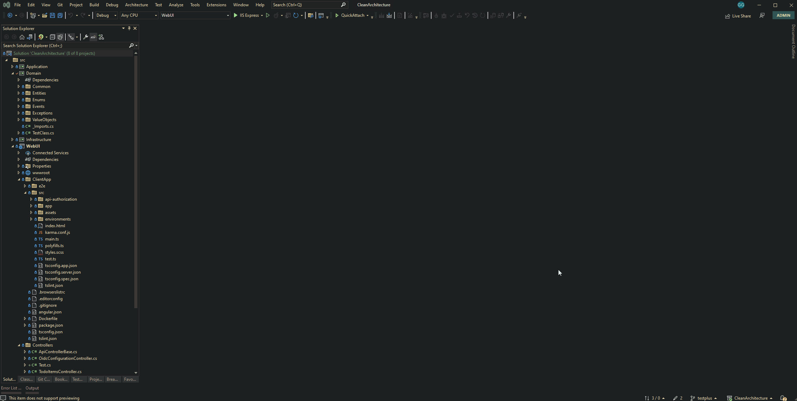

# GitTreeFilter for Visual Studio

This extension for Visual Studio 2022 allows you to filter solution explorer to include only the files changed when comparing to the worktree sometime in the past.
Navigate through all these files as usual, and compare the changes using a context menu item.
This is extremely useful when you are developing a feature on your own branch and want to keep your views focused.

## Rationale

### Stay focused on your own changes in large projects

This plugin allows you to filter solution explorer by showing only the changes you care about. This includes the files that have been changed comparing your current working directory to a Git worktree you can specify as reference by using a branch name, tag name or specific commit.

### Get instant feedback about the actual changes made since the beginning of your work

Every file listed in the solution explorer when the filter is active has a context menu "show changes" which brings the difference between the current file and the one at the selected point in history.

## Attributions

* Icons used:
  * <a target="_blank" href="https://icons8.com/icon/FTMQ4EHZf2AC/tree">Tree</a> icon by <a target="_blank" href="https://icons8.com">Icons8</a>
  * <a target="_blank" href="https://icons8.com/icon/g5xE4eaXvJuI/git-branch">Git branch</a> icon by <a target="_blank" href="https://icons8.com">Icons8</a>
  * <a target="_blank" href="https://icons8.com/icon/33279/commit-git">Commit Git</a> icon by <a target="_blank" href="https://icons8.com">Icons8</a>
  * <a target="_blank" href="https://icons8.com/icon/37972/tag-window">Tag Window</a> icon by <a target="_blank" href="https://icons8.com">Icons8</a>
* This builds on the idea of [GitBranchDiffer](https://marketplace.visualstudio.com/items?itemName=SajalVerma.GitBranchDifferDev17) extending it by a few must-have features.
